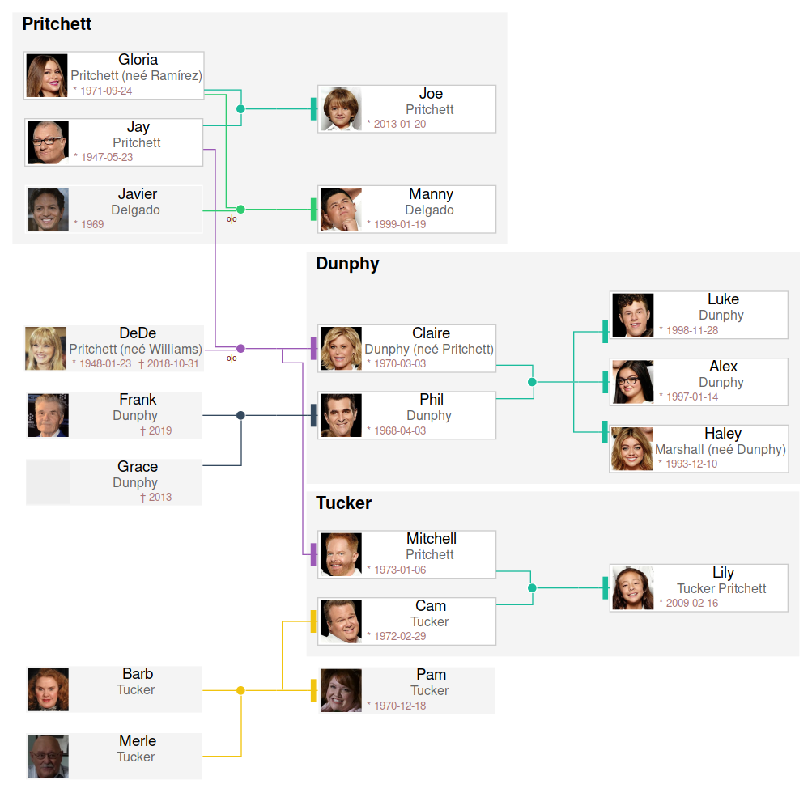

# Nissaga, genealogy tree generator


[](https://coveralls.io/r/vokimon/nissaga)
[](https://pypi.org/project/nissaga/)
[](https://www.gnu.org/licenses/agpl-3.0)
[](https://pypi.org/project/nissaga/)

## About

Nissaga can be used to generate Genealogy trees
from a simple data description in [YAML](https://en.wikipedia.org/wiki/YAML).



[Nissaga](https://en.wiktionary.org/wiki/nissaga) is a Catalan word for _lineage_.

## Installation


```bash
pip install nissaga
```

You need to install [graphviz]. Not the python wrapper library, but the program itself.

[kingraph]: https://github.com/rstacruz/kingraph
[graphviz]: https://graphviz.org

## Usage

The command line interface is still quite simple and
future versions will evolve it to a more powerful one.
Right now it works like this:

```bash
nissaga myfamily.yaml
```

This generates a file `myfamily.pdf`

You can specify a second parameter to choose the output format: png, svg or any supported by graphviz.

```bash
nissaga myfamily.yaml svg
```

## Input file

The input file follows this [Schema](nissaga-schema.json) documented [here](docs/inputformat.md)

A simple example:

```yaml
people:
  me:
    fullname: Alférez Boye, Carmen
    born: 1988-06-12
  sis:
    fullname: Alférez Boye, Diana
    born: 1985-07-04
  dad:
    fullname: Alférez Esquerra, Fran
    born: 1957-03-23
  mom:
    fullname: Boye Gener, Hipatia
    born: 1951-10-28
  dadgranpa:
    fullname: Boye Isidro, Javier
    born: 1932-07-22
    died: 2013-03-19
  dadgranma:
    fullname: Gener Krahe, Laura
    born: 1933-02-12
    died: 2017-09-19
  momgranpa:
    fullname: Alférez Miró, Natanael
    born: 1944-04-15
  momgranma:
    fullname: Esquerra Olivera, Pandora
    born: 1931-01-13
    died: 2007-05-19

families:
  - parents: [mom, dad]
    children: [sis, me] 
  - parents: [dadgranma, dadgranpa]
    children: [dad]
  - parents: [momgranma, momgranpa]
    children: [mom]
```

## Differences with kingraph

This application was started as a clone of the functionality of [kingraph]
to overcome performance and scalability problems with big trees,
and also to extend its functionality.

So, it is mostly back compatible with kingraph format.

The following kingraph features are not supported:

- `family.children2` and `family.parents2` relations are not yet supported

The following features have been introduced by nissaga, and are not available in kingraph (but the yaml would be still compatible).

- Rich **person boxes** with dates, photos and separated first name and surname.
	- `person.born` maybe set to a date, and will appear as `*YYYY-MM-DD` bellow the person's name.
	- `person.died` maybe set to a date or true and will appear as `+YYYY-MM-DD` bellow the person's name.
	- `person.age` age of dead, not used, just to keep track of it when that's the only data we have.
	- `person.pics` is a list of pictures files relative to the yaml file. The first one will be added as person's face. The other pics are not used yet.
- Rich **unions** with marriage and divorce annotations
	- `family.married`: defaults to true. Set it to false to indicate unmarried patnership (`⚯`). Set it to a date to see `⚭YYYY-MM-DD` in the union node.
	- `family.divorced`: defaults to false. Set it to true to indicate a divorce (`⚮`). Set it to a date to see `⚮YYYY-MM-DD` in the union node.
- Attributes for **internal documentation**:
	- `person.todo` a string or list of strings of pending tasks for the person
	- `person.from` origin of the person (country, city...)
	- `person.comments` a string or list of strings of comments
	- `family.notes` a string or list of strings of notes
	- `family.docs` documentation about the family. A list of document paths relative to the yaml file. Not used yet but it is suposed to provide links to the research sources.

